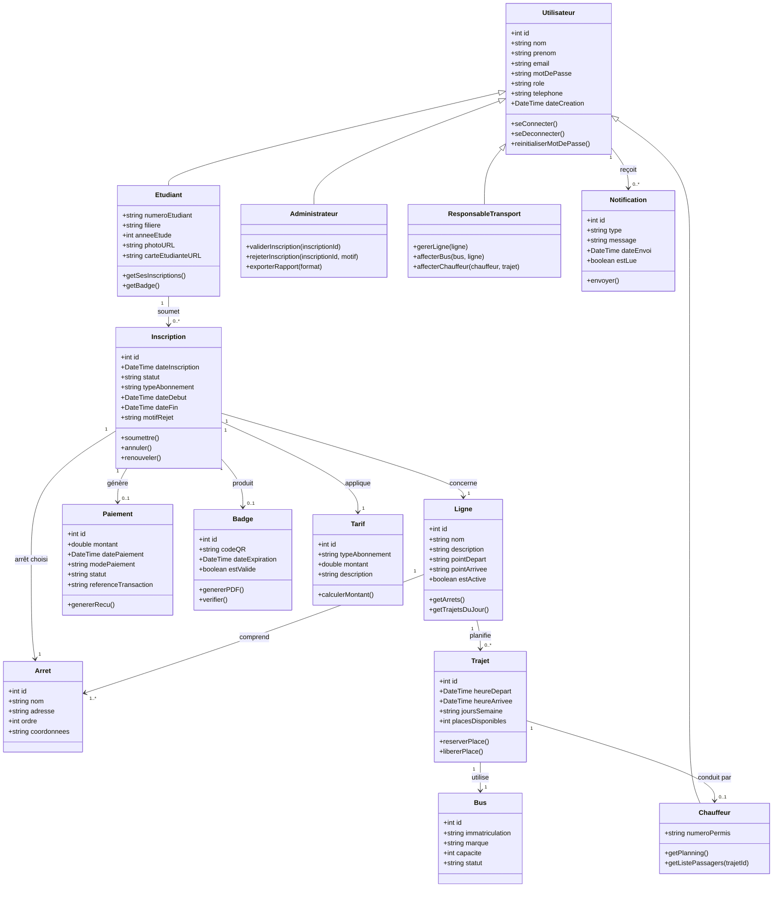
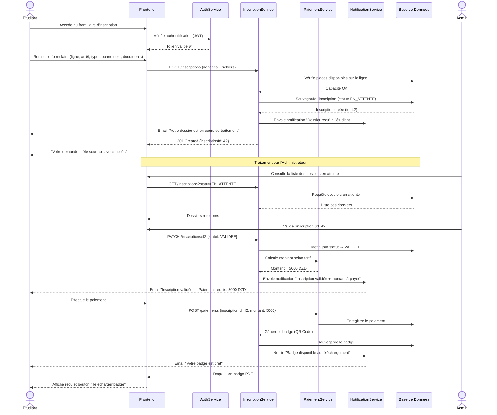
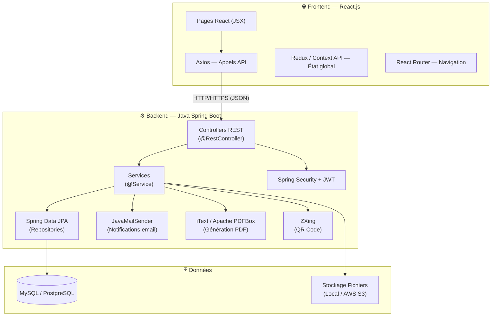

# 📋 Dossier de Projet
## Étude et mise en place d'une application web de gestion des inscriptions des étudiants au service de transport

---

## 1. Cahier des Charges

### 1.1 Contexte et Problématique

De nombreux établissements universitaires proposent un service de transport interne ou inter-campus à leurs étudiants. La gestion manuelle des inscriptions (formulaires papier, listes Excel) engendre des problèmes récurrents : pertes d'information, lenteur du traitement, manque de suivi en temps réel, difficulté à générer des statistiques fiables.

La présente application vise à **digitaliser et centraliser** toutes les opérations liées à l'inscription des étudiants au service de transport universitaire.

### 1.2 Objectifs du Projet

| # | Objectif |
|---|----------|
| 1 | Permettre aux étudiants de s'inscrire en ligne au service de transport |
| 2 | Permettre aux administrateurs de gérer et valider les inscriptions |
| 3 | Gérer les lignes de bus, horaires et arrêts |
| 4 | Éditer et télécharger des badges / cartes de transport |
| 5 | Générer des statistiques et rapports d'utilisation |
| 6 | Envoyer des notifications automatiques (email/SMS) |

### 1.3 Périmètre Fonctionnel

- **Inclus** : inscription, validation, gestion des lignes/bus, paiement, notifications, badges, statistiques.
- **Exclu** : GPS temps réel des bus, application mobile native.

### 1.4 Contraintes Techniques

| Type | Détail |
|------|--------|
| Technologiques | Application web responsive (desktop + mobile) |
| Backend | Java 17+ avec Spring Boot 3.x |
| Frontend | React.js 18+ |
| Sécurité | Spring Security + JWT, HTTPS |
| Performance | Temps de réponse < 2 secondes |
| Base de données | Relationnelle (MySQL / PostgreSQL) via JPA/Hibernate |
| Hébergement | Serveur local ou cloud (Linux + Nginx + JVM) |
| Langues | Français (interface principale) |

### 1.5 Acteurs du Système

| Acteur | Rôle |
|--------|------|
| **Étudiant** | S'inscrit, consulte son statut, télécharge son badge |
| **Administrateur** | Gère les inscriptions, lignes, bus, paiements |
| **Responsable transport** | Supervise les lignes, affecte les bus et chauffeurs |
| **Chauffeur** | Consulte son planning et sa liste de passagers |
| **Système** | Envoie des notifications automatiques |

---

## 2. Fonctionnalités de l'Application

### 2.1 Module Authentification

- [ ] Inscription (création de compte étudiant)
- [ ] Connexion / Déconnexion sécurisée
- [ ] Récupération de mot de passe (par email)
- [ ] Gestion des rôles (Étudiant, Admin, Responsable, Chauffeur)
- [ ] Tableau de bord personnalisé par rôle

### 2.2 Module Inscription au Transport

- [ ] Formulaire d'inscription avec choix : ligne, arrêt, abonnement (mensuel / semestriel / annuel)
- [ ] Téléchargement des pièces justificatives (carte étudiante, photo)
- [ ] Suivi du statut de la demande (En attente / Validée / Rejetée)
- [ ] Renouvellement d'inscription
- [ ] Historique des inscriptions

### 2.3 Module Gestion des Lignes & Bus

- [ ] CRUD des lignes de transport (nom, trajet, horaires)
- [ ] CRUD des arrêts (nom, position)
- [ ] Affectation des bus aux lignes
- [ ] Gestion des capacités de places disponibles
- [ ] Planning hebdomadaire des trajets

### 2.4 Module Paiement

- [ ] Calcul automatique du tarif selon le type d'abonnement
- [ ] Saisie du paiement (espèces / virement — enregistrement manuel ou intégration passerelle)
- [ ] Génération de reçu téléchargeable (PDF)
- [ ] Historique des paiements

### 2.5 Module Badge / Carte de Transport

- [ ] Génération automatique d'un badge numérique (QR code unique)
- [ ] Téléchargement du badge en PDF
- [ ] Renouvellement du badge à chaque inscription
- [ ] Vérification du badge par QR code scanner

### 2.6 Module Notifications

- [ ] Notification email à chaque changement de statut de dossier
- [ ] Rappel d'expiration d'abonnement (J-7, J-1)
- [ ] Notification de nouvelle inscription pour l'admin
- [ ] Alertes en cas de changement de ligne / horaire

### 2.7 Module Administration & Rapports

- [ ] Tableau de bord avec KPIs (nb inscrits, taux de remplissage, revenus)
- [ ] Liste et filtrage des étudiants inscrits
- [ ] Validation / rejet des dossiers d'inscription
- [ ] Exportation des données (Excel / PDF)
- [ ] Rapports statistiques par ligne, par période

---

## 3. Diagrammes UML

### 3.1 Diagramme de Cas d'Utilisation

```mermaid
flowchart TD
    Etudiant((Étudiant))
    Admin((Administrateur))
    Responsable((Responsable\nTransport))
    Chauffeur((Chauffeur))
    Systeme((Système))

    subgraph UC["Système de Gestion des Inscriptions Transport"]
        UC1[S'authentifier]
        UC2[S'inscrire au service transport]
        UC3[Soumettre un dossier d'inscription]
        UC4[Consulter le statut de sa demande]
        UC5[Télécharger son badge]
        UC6[Effectuer un paiement]
        UC7[Consulter ses abonnements]

        UC8[Gérer les inscriptions]
        UC9[Valider / Rejeter un dossier]
        UC10[Gérer les étudiants]
        UC11[Générer des rapports]
        UC12[Gérer les paiements]

        UC13[Gérer les lignes de bus]
        UC14[Gérer les arrêts]
        UC15[Affecter bus et chauffeurs]
        UC16[Gérer les horaires]

        UC17[Consulter planning]
        UC18[Consulter liste passagers]

        UC19[Envoyer notifications]
        UC20[Générer badges automatiquement]
    end

    Etudiant --> UC1
    Etudiant --> UC2
    Etudiant --> UC3
    Etudiant --> UC4
    Etudiant --> UC5
    Etudiant --> UC6
    Etudiant --> UC7

    Admin --> UC1
    Admin --> UC8
    Admin --> UC9
    Admin --> UC10
    Admin --> UC11
    Admin --> UC12

    Responsable --> UC1
    Responsable --> UC13
    Responsable --> UC14
    Responsable --> UC15
    Responsable --> UC16

    Chauffeur --> UC1
    Chauffeur --> UC17
    Chauffeur --> UC18

    Systeme --> UC19
    Systeme --> UC20
```

---

### 3.2 Diagramme de Classes

---

### 3.3 Diagramme de Séquence — Inscription d'un Étudiant

---

## 4. Architecture Technique

---

## 5. Répartition Détaillée des Tâches de Développement

### 📁 PHASE 1 — Planification & Setup (Semaine 1-2)

| ID | Tâche | Responsable | Durée |
|----|-------|-------------|-------|
| T01 | Rédaction finale du cahier des charges | Chef de projet | 2j |
| T02 | Modélisation de la base de données (MCD → MLD) | Dev Backend | 2j |
| T03 | Création du dépôt Git et structure du projet (monorepo ou `/backend` + `/frontend`) | DevOps | 1j |
| T04 | Init projet Spring Boot (Spring Initializr) : Web, Security, JPA, Mail, Validation | Dev Backend | 1j |
| T05 | Init projet React (`create-react-app` ou Vite), configuration Axios, React Router | Dev Frontend | 1j |
| T06 | Maquettage UI/UX (wireframes) des pages principales | Dev Frontend | 3j |

---

### 📁 PHASE 2 — Backend : Base de données & API (Semaine 3-5)

#### 2.1 Base de Données & Modèle JPA

| ID | Tâche | Durée |
|----|-------|-------|
| T07 | Entités JPA : `Utilisateur`, `Etudiant`, `Administrateur`, `Chauffeur` + héritage (`@Inheritance`) | 1j |
| T08 | Entités JPA : `Ligne`, `Arret`, `Bus`, `Trajet` + relations (`@ManyToMany`, `@OneToMany`) | 1j |
| T09 | Entités JPA : `Inscription`, `Paiement`, `Badge`, `Notification`, `Tarif` | 1j |
| T10 | Configuration `application.properties` (datasource, JPA DDL auto) | 0.5j |
| T11 | Scripts SQL de données initiales (DataLoader ou Flyway/Liquibase) | 1j |
| T12 | Mise en place des migrations versionnées (Flyway recommandé) | 0.5j |

#### 2.2 Spring Security & JWT

| ID | Tâche | Durée |
|----|-------|-------|
| T13 | Configuration Spring Security (`SecurityFilterChain`, CORS, CSRF disabled) | 1j |
| T14 | Implémentation `JwtTokenProvider` (génération + validation du token) | 1j |
| T15 | `JwtAuthenticationFilter` (filtre de chaque requête) | 0.5j |
| T16 | `POST /api/auth/register` — `AuthController` + `UserDetailsService` | 1j |
| T17 | `POST /api/auth/login` — retourne `accessToken` + `refreshToken` | 0.5j |
| T18 | `POST /api/auth/forgot-password` + `reset-password` (email + token temporaire) | 1j |
| T19 | `@PreAuthorize` par rôle (ETUDIANT, ADMIN, RESPONSABLE, CHAUFFEUR) | 0.5j |

#### 2.3 API REST — Inscriptions

| ID | Tâche / Endpoint | Durée |
|----|-----------------|-------|
| T20 | `InscriptionController`, `InscriptionService`, `InscriptionRepository` (architecture couches) | 1j |
| T21 | `POST /api/inscriptions` — soumettre une inscription + `@Valid` DTOs | 1j |
| T22 | `GET /api/inscriptions/{id}` + `GET /api/inscriptions` (pagination + `Specification` JPA) | 1j |
| T23 | `PATCH /api/inscriptions/{id}/valider` et `/rejeter` | 1j |
| T24 | `DELETE /api/inscriptions/{id}` | 0.5j |
| T25 | Upload fichiers (`MultipartFile` + stockage disque ou S3) | 1j |

#### 2.4 API REST — Lignes, Bus, Trajets

| ID | Tâche / Endpoint | Durée |
|----|-----------------|-------|
| T26 | CRUD `/api/lignes` — `LigneController` + `LigneService` | 1j |
| T27 | CRUD `/api/arrets` — `ArretController` | 0.5j |
| T28 | CRUD `/api/bus` — `BusController` | 0.5j |
| T29 | CRUD `/api/trajets` — `TrajetController` (planning hebdomadaire) | 1j |
| T30 | `GET /api/lignes/{id}/places-disponibles` — logique de capacité | 0.5j |

#### 2.5 API REST — Paiements & Badges

| ID | Tâche / Endpoint | Durée |
|----|-----------------|-------|
| T31 | `POST /api/paiements` — `PaiementController` + `PaiementService` | 1j |
| T32 | `GET /api/paiements/{id}/recu` — génération PDF avec **iText 7** ou **Apache PDFBox** | 1j |
| T33 | `POST /api/badges/generate/{inscriptionId}` — génération QR Code avec **ZXing** | 1.5j |
| T34 | `GET /api/badges/{id}/download` — retourne `ResponseEntity<byte[]>` (PDF) | 1j |
| T35 | `GET /api/badges/verify/{qrCode}` — vérification validité | 0.5j |

#### 2.6 Notifications & Rapports

| ID | Tâche | Durée |
|----|-------|-------|
| T36 | Service email avec **JavaMailSender** (`spring-boot-starter-mail`) + templates Thymeleaf | 1j |
| T37 | Scheduler Spring (`@Scheduled`) pour rappels d'expiration d'abonnement | 1j |
| T38 | `GET /api/rapports/inscriptions` — statistiques globales (JPQL / Native Query) | 1j |
| T39 | `GET /api/rapports/export` — export Excel avec **Apache POI** + PDF | 1.5j |

---

### 📁 PHASE 3 — Frontend (Semaine 5-8)

#### 3.1 Setup & Infrastructure React

| ID | Tâche | Durée |
|----|-------|-------|
| T40 | Configuration Axios (baseURL, intercepteurs pour JWT dans headers) | 0.5j |
| T41 | Configuration React Router v6 (routes publiques / protégées par rôle) | 0.5j |
| T42 | Gestion état global : Context API ou Redux Toolkit (auth, user info) | 1j |
| T43 | Composants communs : `Navbar`, `Sidebar`, `Footer`, `PrivateRoute` | 1j |
| T44 | Pages communes : Accueil, Connexion, Inscription, Mot de passe oublié | 1.5j |

#### 3.2 Espace Étudiant

| ID | Page / Composant | Durée |
|----|-----------------|-------|
| T45 | Tableau de bord étudiant | 1j |
| T46 | Formulaire d'inscription au transport | 2j |
| T47 | Page suivi de demande (timeline statut) | 1j |
| T48 | Page "Mes abonnements" | 1j |
| T49 | Page téléchargement badge / QR Code | 1j |
| T50 | Page historique paiements | 0.5j |
| T51 | Page profil étudiant (modification infos) | 1j |

#### 3.3 Espace Administrateur

| ID | Page / Composant | Durée |
|----|-----------------|-------|
| T52 | Tableau de bord admin (KPIs, graphiques) | 2j |
| T53 | Page liste des inscriptions + filtres | 1.5j |
| T54 | Page détail d'une inscription (validation) | 1j |
| T55 | Page gestion des étudiants | 1j |
| T56 | Page gestion des paiements | 1j |
| T57 | Page rapports et exportations | 1.5j |

#### 3.4 Espace Responsable Transport

| ID | Page / Composant | Durée |
|----|-----------------|-------|
| T58 | Gestion des lignes (CRUD UI) | 1.5j |
| T59 | Gestion des arrêts (CRUD UI) | 1j |
| T60 | Gestion des bus (CRUD UI) | 1j |
| T61 | Gestion des trajets et planning | 1.5j |
| T62 | Affectation chauffeurs | 1j |

#### 3.5 Espace Chauffeur

| ID | Page / Composant | Durée |
|----|-----------------|-------|
| T63 | Tableau de bord chauffeur | 0.5j |
| T64 | Page planning (trajets du jour / semaine) | 1j |
| T65 | Page liste passagers par trajet | 1j |

---

### 📁 PHASE 4 — Tests & Intégration (Semaine 9-10)

| ID | Tâche | Durée |
|----|-------|-------|
| T66 | Tests unitaires backend : **JUnit 5** + **Mockito** (Services, Repositories) | 3j |
| T67 | Tests d'intégration Spring : `@SpringBootTest` + `MockMvc` pour les Controllers | 2j |
| T68 | Tests API : **Postman** (collections + tests automatisés) | 1j |
| T69 | Tests Frontend React : **React Testing Library** + **Jest** | 2j |
| T70 | Tests E2E : **Cypress** (flux inscription complet) | 1j |
| T71 | Tests de charge : **JMeter** ou **k6** | 1j |
| T72 | Correction des bugs | 2j |

---

### 📁 PHASE 5 — Déploiement & Livraison (Semaine 11-12)

| ID | Tâche | Durée |
|----|-------|-------|
| T73 | Build backend : `mvn clean package` → JAR exécutable | 0.5j |
| T74 | Build frontend : `npm run build` → dossier `/dist` | 0.5j |
| T75 | Configuration Nginx (reverse proxy vers Spring Boot `:8080`, serveur des fichiers React) | 1j |
| T76 | CI/CD avec **GitHub Actions** (build Maven + tests + build React + déploiement) | 1.5j |
| T77 | Déploiement sur VPS Linux (ou Docker Compose : `backend` + `frontend` + `db`) | 1j |
| T78 | Documentation technique API avec **Swagger / SpringDoc OpenAPI** | 1j |
| T79 | Rédaction manuel utilisateur + formation | 2j |
| T80 | Recette finale et validation client | 2j |

---

## 6. Estimation Globale

| Phase | Durée Estimée |
|-------|---------------|
| Phase 1 — Planification & Setup | 2 semaines |
| Phase 2 — Backend & API | 3 semaines |
| Phase 3 — Frontend | 4 semaines |
| Phase 4 — Tests | 2 semaines |
| Phase 5 — Déploiement | 1 semaine |
| **TOTAL** | **≈ 12 semaines** |

---

## 7. Stack Technique

| Couche | Technologies |
|--------|-------------|
| **Frontend** | React.js 18 + Vite, React Router v6, Axios, Redux Toolkit |
| **UI / Styles** | CSS Modules ou Styled Components (+ Material UI / Ant Design) |
| **Backend** | Java 17+ — Spring Boot 3.x |
| **API** | Spring Web (`@RestController`), Spring HATEOAS |
| **Sécurité** | Spring Security 6 + JWT (`jjwt` library) |
| **Persistance** | Spring Data JPA + Hibernate — MySQL 8 / PostgreSQL 15 |
| **Migration DB** | Flyway |
| **PDF** | iText 7 ou Apache PDFBox |
| **QR Code** | ZXing (`core` + `javase`) |
| **Email** | Spring Mail + JavaMailSender (SMTP) + Thymeleaf templates |
| **Export Excel** | Apache POI |
| **Documentation API** | SpringDoc OpenAPI 3 (Swagger UI) |
| **Tests Backend** | JUnit 5, Mockito, MockMvc, Testcontainers |
| **Tests Frontend** | Jest, React Testing Library, Cypress |
| **Build** | Maven (backend) + Vite/npm (frontend) |
| **Versioning** | Git + GitHub / GitLab |
| **Déploiement** | VPS Linux + Nginx + JVM **ou** Docker Compose |

---

*Document généré le 12 Mai 2026 — Projet : Gestion des Inscriptions au Service de Transport Universitaire*
